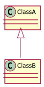
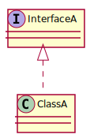
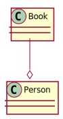
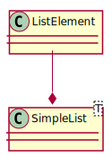
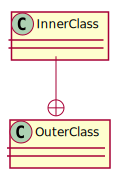
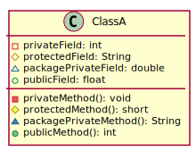
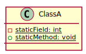
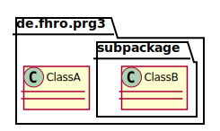

# Relationships

## Inheritance

### Classes

Inheritance is described with an arrow (empty arrowhead) from the child to the parent class.



Java sample code:

```java
class ClassA {
    //...
}

class ClassB extends ClassA {
    //..
}
```

### Interfaces

The implementation of an interface is described with an arrow (dashed line, empty arrow) from the class to the implemented interface.



Java sample code:

```java
interface InterfaceA {
    //...
}

class ClassA implements InterfaceA {
    //...
}
```

## Aggregation

Aggregation and composition are quite the same.
Both describe a relationship between two classes where one class contains one or more instances of the other class.
The difference is that in an aggregation the child can exist without the parent where in a [composition](#Composition) the child class can't exist without the parent class.
](#Composition)In the given example a book can exist without an owner.

An aggregation is described with a line from the child to the parent element where at the parents side is an empty diamond.



Java sample code:

```java
class Person {
    private List<Book> books;
    //...
}

class Book {
    //...
}
```

## Composition

As already mentioned a composition describes the relationship between two classes where the child class can't exist without an instance of the parent class.

The following UML models a class `SimpleList<T>` and its containing `ListElement`.
It doesn't make sense to have a single `ListElement` without a containing `SimpleList<T>`.

A composition is described with a line from the child to the parent element where at the parents side is a filled diamond.



Java sample code:

```java
class SimpleList<T> {
    private ListElement listHead;
    //...
}

class ListElement {
    //...
}

```

## Nested classes

Nested classes are classes which are declared within the scope of another class.
PlantUML does not support the declaration of `static` or `static` nested classes (it supports only `static` fields and methods).



Java sample code:

```java

class OuterClass {
    //...
    class InnerClass {
        //...
    }
}

```

# Visibility/access modifiers

This UML demonstrates all possible access modifiers.



This Java code is the direct equivalent of the previous UML

```java
class ClassA {
    private int privateField;
    protected String protectedField;
    double packagePrivateField;
    public float publicField;

    private void privateMethod(){
        //...
    }

    protected short protectedMethod() {
        return 1s;
    }

    String packagePrivateMethod() {
        return "";
    }

    public int publicMethod() {
        return 1;
    }
}
```

# Classifiers

## `static`

Static fields and methods are <u>underlined</u> in the UML spec.



```java
class ClassA {
    private static int staticField = 1337;

    public static void staticMethod() {
        //...
    }
}
```

## `abstract`

As `abstract` fields don't make much sense it's only possible to declare `abstract` methods.
`abstract` methods are declared with an _italic_ font.


Java sample code:

```java
abstract class ClassA {
    public abstract String greet(String name);
}
```

# Packages

There's nothing special to know about packages in UML/PlantUML.



Java sample code(should be located in two files in two different folders):

```java

package de.fhro.prg3 {
    class ClassA {
        //...
    }
}

package de.fhro.prg3.subpackage {
    class ClassB {
        //...
    }
}

```

Directory structure:
```
de/
 |-fhro/
    |-prg3/
        |- ClassA.java
        |- subpackage/
            |- ClassB.java
```